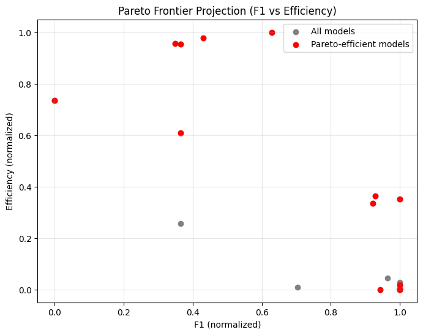

# Problem Formulation and Description

## Decision-Making Problem

In practical machine learning workflows, selecting an appropriate classification algorithm represents a complex decision-making problem involving multiple competing objectives. Different models may achieve similar predictive accuracy while significantly differing in computational efficiency, stability, interpretability, and deployment cost. Consequently, model selection cannot be reduced to optimizing a single performance metric.

The objective of this study is to select the **most suitable classification model** using a multi-criteria decision-making framework. The decision problem consists of choosing the best alternative from a set of trained classification models evaluated according to several quantitative criteria derived from empirical experiments.

This problem reflects a realistic professional scenario faced by data scientists and deep learning engineers when preparing models for deployment. In real systems, models must satisfy not only predictive performance requirements but also operational constraints such as latency, scalability, and maintainability.

Therefore, the decision task is formulated as:

> **Selecting the optimal classification model that provides the best overall trade-off between predictive quality, computational efficiency, robustness, and interpretability.**

---

## Importance of Solving the Problem

In industrial and research environments, relying solely on accuracy or F1-score may lead to suboptimal decisions. For example:
- highly accurate models may require excessive computational resources
- complex ensemble models may introduce unacceptable inference latency
- black-box models may violate interpretability requirements in regulated domains
- unstable models may produce inconsistent performance across datasets

Modern machine learning systems must balance multiple objectives simultaneously. Multi-criteria decision-making methods provide a structured mathematical framework allowing objective comparison between alternatives and transparent justification of the final choice.

Applying social choice theory and Pareto optimality enables transforming model selection into a formal decision process rather than an intuitive or subjective preference.

Thus, solving this problem demonstrates how decision theory principles can enhance real-world machine learning engineering practices.

---

## Dataset and Data Source

The experimental evaluation is performed using the *Mushroom Classification Dataset*, publicly available through the [UCI Machine Learning Repository](https://archive.ics.uci.edu/dataset/73/mushroom) and distributed via [Kaggle](https://www.kaggle.com/datasets/uciml/mushroom-classification).

The dataset contains categorical descriptions of mushroom specimens with the task of predicting whether a mushroom is edible or poisonous.

Although the dataset domain concerns biological classification, its thematic content is **not central to this study**. The dataset serves as a representative binary classification problem analogous to applications such as:
- disease diagnosis
- fraud detection
- anomaly detection
- safety risk assessment

The primary purpose of the dataset in this work is to provide real empirical performance measurements for multiple classification algorithms under identical experimental conditions.

The dataset was selected because it:
- is publicly accessible and reproducible
- contains real observational data
- allows fair benchmarking across many algorithms
- enables consistent comparison using multiple evaluation metrics

---

## Alternatives (Evaluated Models)

Each alternative corresponds to a trained classification model evaluated using identical preprocessing and validation procedures. The experimental setup includes models from different methodological families to ensure diversity of approaches.

The evaluated alternatives include:

**Tree-Based Models**
- DecisionTree_default
- DecisionTree_shallow
- DecisionTree_pruned

**Ensemble Methods**
- RandomForest_small
- RandomForest_large
- ExtraTrees_fast
- ExtraTrees_large
- GradientBoosting_fast
- GradientBoosting_slow
- AdaBoost_light
- AdaBoost_heavy

**Kernel and Distance-Based Methods**
- SVC_linear
- SVC_rbf
- SVC_poly
- KNN_3
- KNN_15

**Linear Models**
- LogReg_weak_reg
- LogReg_strong_reg
- Ridge_alpha_small
- Ridge_alpha_large
- LDA_svd
- LDA_lsqr

**Probabilistic Models**
- GaussianNB_default
- GaussianNB_smoothed

> *You can check methods' extended details in `./decision_metrics_collection/alternatives.py` in `MODELS` variable and refer to [scikit-learn documentation](https://scikit-learn.org/stable/user_guide.html).* 

In total, more than 10 alternatives are considered, satisfying the assignment requirement while ensuring meaningful methodological diversity.

---

## Evaluation Criteria

The alternatives are assessed using experimentally measured metrics reflecting multiple aspects of model performance and practical usability.

### Predictive Performance Criteria

To evaluate classification quality, several standard performance metrics derived from the confusion matrix are used. These metrics quantify different aspects of predictive behavior and together provide a comprehensive assessment of model performance.

Let a binary classification problem consist of observations belonging to two classes: positive and negative. After prediction, outcomes can be summarized using a confusion matrix:

| | Predicted Positive | Predicted Negative |
|-|-|-|
| Actual Positive | True Positive ( $TP$ ) | False Negative ( $FN$ ) |
| Actual Negative | False Positive ( $FP$ ) | True Negative ( $TN$ ) |

1. **Accuracy**

    Accuracy measures the overall proportion of correctly classified observations.

    $\mathrm{Accuracy} = \frac{TP + TN}{TP + TN + FP + FN}$

2. **Precision**

    Precision evaluates the reliability of positive predictions, i.e., how many predicted positives are actually correct. High precision indicates a low number of false positive errors.

    $\mathrm{Precision} = \frac{TP}{TP + FP}$

3. **Recall**

    Indicates the model’s ability to detect positive instances. A high recall value indicates that few positive samples are missed.

    $\mathrm{Recall} = \frac{TP}{TP + FN}$

4. **F1-score**

    The F1-score combines precision and recall using their harmonic mean, providing a balanced evaluation when both false positives and false negatives are important. The harmonic mean penalizes extreme imbalance between precision and recall.

    $\mathrm{F_1} = 2 \frac{\mathrm{Precision} \cdot \mathrm{Recall}}{\mathrm{Precision} + \mathrm{Recall}}$

5. **ROC-AUC**

    The Receiver Operating Characteristic (ROC) curve represents the relationship between:
    - True Positive Rate ( $TPR$ )
    - False Positive Rate ( $FPR$ )

    where

    $TPR = \frac{TP}{TP + FN}$ **($\mathrm{Recall}$)* \
    $FPR = \frac{FP}{FP + TN}$

    The ROC-AUC metric corresponds to the area under this curve (AUC):

    $\mathrm{ROC-AUC} = \int^1_0 TPR(FPR) d(FPR)$

    ROC-AUC measures the probability that a randomly chosen positive instance receives a higher predicted score than a randomly chosen negative instance.

6. **Cross-validation Mean Score** (cv_mean)

    To estimate model generalization ability, $k$-fold cross-validation is performed. The dataset is partitioned into
    $k$ disjoint subsets. Each subset is used once as validation data while the remaining folds are used for training.

    Let $s_i$ denote the evaluation score obtained in fold $i$, where $i = 1, 2, \dots, k$. 

    The cross-validation mean score is defined as: \
    $cv_{mean} = \frac{1}{k} \sum^{k}_{i=1} s_i$

    This metric approximates expected performance on unseen data.

7. **Cross-validation Standard Deviation** (cv_std)

    Model stability is evaluated using the variability of cross-validation scores: \
    $cv_{std} = \sqrt{\frac{1}{k} \sum^{k}_{i=1} (s_i - cv_{mean})^2}$

    Lower values indicate more stable and consistent performance across different data splits.

### Computational Efficiency Criteria

1. **Training Time** (train_time_sec)

    Training time ($T_{train}$) represents the total computational time required to fit a model using the training dataset. Training time is an important factor during model development and hyperparameter optimization, especially when repeated retraining is required.

    Since shorter training time is preferable, this criterion is naturally a minimization criterion.

2. **Inference Time** (inference_time_sec)

    Inference time ($T_{inf}$) measures the time required for a trained model to generate predictions. Denotes the total prediction time for $N$ samples.

    Lower inference time is essential for real-time and large-scale applications. This criterion is also minimized.

3. **Latency** 

    Latency represents the response delay between receiving an input and producing a prediction output (inference time per sample). It reflects operational responsiveness in deployment environments. 

    $T_{lat} = \frac{T_{inf}}{N}$

    Lower latency indicates faster response capability. 

4. **Throughput**

    Throughput quantifies the processing capacity of a model, defined as the number of predictions that can be generated per unit time.

    $\mathrm{Throughput} = \frac{N}{T_{inf}}$ or $\mathrm{Throughput} = \frac{1}{T_{lat}}$

    Unlike latency, throughput is a maximization criterion.

5. **Model Size** (model_size_kb)

   Model size represents the memory footprint required to store the trained model.

    Model size influences:
    - deployment feasibility
    - memory consumption
    - model transfer cost
    - edge-device compatibility

    Smaller models are preferred; therefore, this criterion is minimized.

### Model Complexity and Usability Criteria

**Concept of Interpretability:**

In addition to predictive performance and computational efficiency, modern machine learning systems must often satisfy requirements related to transparency and explainability. Interpretability refers to the degree to which a human can understand the internal logic of a model and explain how input variables influence predictions.

Formally, interpretability can be described as the extent to which a model allows a human observer to establish a mapping:

$f : X \to Y$

between input features $X$ and predicted outcomes $Y$ in a comprehensible and explainable manner.

Unlike accuracy or execution time, interpretability is not directly measurable through physical observation. Instead, it represents a qualitative property reflecting human cognitive accessibility of model behavior.

---

**Importance of Interpretability in Practical Applications:** 

Interpretability plays a critical role in many real-world domains, including:
- medical decision support systems
- financial risk assessment
- legal and regulatory environments
- safety-critical autonomous systems

In such contexts, stakeholders must be able to:
- justify decisions
- detect model biases
- verify logical consistency
- build trust in automated systems

Highly complex models may achieve strong predictive performance but can behave as *black boxes*, limiting their practical usability despite superior accuracy.

---

**Expert-Based Interpretability Scale:**

To incorporate interpretability into the decision model, an ordinal scoring system is introduced based on widely accepted machine learning interpretability literature (e.g. [Interpretable Machine Learning in Healthcare](https://www.researchgate.net/publication/328416903_Interpretable_Machine_Learning_in_Healthcare)) and practitioner consensus.

Each model is assigned an interpretability score:

$I \in \{1, 2, 3, 4, 5\}$

where higher values indicate greater interpretability.

| Score | Interpretability Level | Description |
|-|-|-|
| 5 | Very High | Model decisions easily understandable; transparent structure |
| 4 | High | Mostly interpretable with moderate complexity |
| 3 | Medium | Partial interpretability due to aggregated decision mechanisms |
| 2 | Low | Complex nonlinear relations difficult to explain |
| 1 | Very Low | Black-box behavior |

---

**Assignment Principles:**

Scores are assigned according to structural properties of model classes:

- Highly Interpretable Models (Score = 5)
    - Logistic Regression
    - Linear Models
    - Simple Decision Trees

    Characteristics:
    - explicit coefficients
    - direct feature influence interpretation
    - rule-based reasoning

- Moderately Interpretable Models (Scores = 3-4)
    - Random Forest
    - Extra Trees
    - Gradient Boosting
    - Linear Discriminant Analysis

    Characteristics:
    - aggregate decision mechanisms
    - feature importance available but global logic less transparent

- Low Interpretability Models (Scores = 1-2)
    - Support Vector Machines with nonlinear kernels
    - k-Nearest Neighbors
    - Neural networks
    - Complex ensemble methods

    Characteristics:
    - nonlinear decision boundaries
    - lack of explicit reasoning structure

> *You can find the assigned interpretability scores in `./decision_data_collection/alternatives.py` as `INTERPRETABILITY` variable.*

---

**Role in the Decision Framework:** \
Within the overall evaluation process, interpretability:
- complements performance and efficiency metrics
- introduces human-centered considerations
- influences social choice aggregation rules

---

## Direction of Optimization

Not all criteria share the same optimization direction, as you could saw from above.

### Maximization Criteria
- Accuracy
- Precision
- Recall
- F1-score
- ROC-AUC
- Cross-validation mean
- Throughput
- Efficiency
- Interpretability

### Minimization Criteria
- Training time
- Inference time
- Model size
- Latency
- Cross-validation standard deviation

To enable unified comparison, minimization criteria will be transformed into maximization criteria during preprocessing.

---

## Characteristics of the Experimental Results

The obtained experimental results reveal an important real-world phenomenon: several high-capacity models achieve nearly perfect predictive performance on the dataset. Consequently, predictive metrics alone cannot differentiate between alternatives.

This situation highlights the necessity of multi-criteria decision analysis, where secondary characteristics such as computational efficiency, robustness, and interpretability become decisive factors.

Therefore, this dataset provides an ideal case study demonstrating why Pareto optimality and social choice methods are required in modern machine learning model selection.

---

## Expected Outcome

The goal is not simply identifying the most accurate classifier but determining the model that achieves the best overall balance across all evaluation dimensions.

The decision process will therefore include:
- transformation and normalization of criteria
- construction of the Pareto frontier
- aggregation using weighted decision rules
- application of social choice mechanisms

This structured methodology ensures that the final decision is transparent, reproducible, and theoretically justified.

Based on preliminary empirical observations, it is hypothesized that `DecisionTree_default` will emerge as the overall preferred model.

This expectation is motivated by the following considerations:
- **Strong predictive performance** \
    The model achieves competitive accuracy and F1-score on the evaluation dataset.

- **Moderate computational cost** \
    Training and inference times remain relatively low compared to more complex ensemble or kernel-based models.

- **High interpretability** \
    Decision trees provide explicit rule-based reasoning, enabling direct inspection of classification logic, which is particularly valuable in domains analogous to medical or risk classification tasks.

- **Balanced trade-off** \
    While some models may slightly outperform it in isolated metrics, the decision tree is expected to achieve the most favorable compromise across all evaluation dimensions.

---

# Normalization of the criteria
All infinite values are replaced with max finite value in column; \
*None* values are replaced with mean values (in `roc-auc` criteria) \
`cv_std`, `train_time_sec`, `inference_time_sec`, `model_size_kb`, `latency` colums are transformed from minimization to maximization. \
Min–Max normalization is used as a standard approach\
$x_{ij}′ = \frac{max_j − min_j}{x_{ij} − min_j}$

# Pareto set

The Pareto set consists of all alternatives that are **not dominated** by any other alternative. 

Alternative $a_i$ **dominates** alternative $a_k$ if: \
$x_{ij} \ge x_{kj}$ for all $j$ \
and \
$x_{ij} \gt x_{kj}$ for at least one $j$

Since the decision problem involves more than two criteria, a full visualization of the Pareto frontier is not possible. \
Therefore, a two-dimensional projection onto the (F1, Efficiency) plane was constructed. \
Pareto-efficient models are highlighted, illustrating the trade-off between predictive performance and computational efficiency.

# Best alternative selection

> *You can find all criteria and rankings realizations in `./alternative_selection/main.ipynb` and `./alternative_selection/utils.py`.*

## Weighted linear combination of criteria

To compute a weighted sum the weights need to be set to the criteria. \
We have **4 groups of criteria**:
1. Predictive Performance (accuracy, precision, recall, f1, roc_auc)
2. Stability / Variance (cv_mean, cv_std, stability)
3. Computational Cost (train_time_sec, inference_time_sec, latency, throughput, efficiency)
4. Resource & Practical Constraints (model_size_kb, interpretability)

To choose a model that balances strong performance but also reasonable speed & size the optimal weights can be distributed as such:
- Performance: $40\%$
- Stability: $15\%$
- Computation: $25\%$
- Practical: $20\%$

Therefore for each criteria:

**Performance** ($40\%$) since some metrics are correlated
- accuracy: $0.03$ (can be misleading)
- precision: $0.05$
- recall: $0.07$
- f1: $0.15$ (slightly higher, since it's balanced metric)
- roc_auc: $0.1$ (threshold-independent robustness)

**Stability** ($15\%$)
- cv_mean: $0.02$
- cv_std: $0.08$
- stability: $0.05$

**Computation** ($25\%$)
- train_time_sec: $0.03$
- inference_time_sec: $0.08$
- latency: $0.06$
- throughput: $0.05$
- efficiency: $0.03$

**Practical** ($20\%$)
- model_size_kb: $0.12$
- interpretability: $0.08$

---

For each Pareto model $M_i$: \
$S_i = \sum_{j=1}^{15} w_j \cdot x_{ij}$ \
Winner: \
$M^∗ = argmax S_i$

#### Result ranking
| model                    | WLC_score |
|--------------------------|-----------|
| **DecisionTree_default** | 0.954354  |
| DecisionTree_shallow     | 0.890697  |
| GradientBoosting_fast    | 0.879892  |
| DecisionTree_pruned      | 0.853819  |
| LogReg_weak_reg          | 0.773293  |
| KNN_3                    | 0.663800  |
| LogReg_strong_reg        | 0.654004  |
| KNN_15                   | 0.650671  |
| Ridge_alpha_large        | 0.638895  |
| Ridge_alpha_small        | 0.624398  |
| LDA_svd                  | 0.603204  |
| GaussianNB_smoothed      | 0.415588  |

The ranking methods are really sensitive to weights that we set for the criteria. \
Let's try to switch weights a little and see if the winner changes \
Now add more weight to **computational efficiency** and less to accuracy, since almost all our models perform equally well

Weights:
- accuracy: $0.02$  
- precision: $0.04$  
- recall: $0.05$  
- f1: $0.10$  
- roc_auc: $0.09$  
- cv_mean: $0.01$  
- cv_std: $0.06$  
- train_time_sec: $0.05$  
- inference_time_sec: $0.15$  
- model_size_kb: $0.10$  
- latency: $0.10$  
- throughput: $0.08$  
- efficiency: $0.07$  
- stability: $0.03$  
- interpretability: $0.05$

#### Result ranking
| model                    | WLC_score |
|--------------------------|-----------|
| **DecisionTree_default** | 0.912646  |
| DecisionTree_shallow     | 0.890850  |
| DecisionTree_pruned      | 0.867078  |
| GradientBoosting_fast    | 0.848144  |
| LogReg_weak_reg          | 0.820631  |
| LogReg_strong_reg        | 0.739092  |
| Ridge_alpha_large        | 0.738974  |
| Ridge_alpha_small        | 0.710843  |
| LDA_svd                  | 0.691312  |
| KNN_15                   | 0.635454  |
| KNN_3                    | 0.599064  |
| GaussianNB_smoothed      | 0.556900  |

The winner and top-4 alternatives didn't change, so `DecisionTree_default` model is robust not only in performance, but also in computational efficiency

## Weighted distance to the "ideal" point

For model $i$: \
$D_i = \sqrt{\sum_{j=1}^m w_j \cdot (1−x_{ij})^2}$ \
Smaller $D_i$ is closer to ideal and better.

We will use first set of weights, because it is more balanced

#### Result ranking
| model                    | distance_to_ideal |
|--------------------------|-------------------|
| **DecisionTree_default** | 0.158744          |
| DecisionTree_shallow     | 0.221746          |
| GradientBoosting_fast    | 0.291135          |
| DecisionTree_pruned      | 0.307929          |
| LogReg_weak_reg          | 0.321224          |
| LogReg_strong_reg        | 0.482907          |
| KNN_3                    | 0.498150          |
| KNN_15                   | 0.506109          |
| Ridge_alpha_large        | 0.509645          |
| LDA_svd                  | 0.516907          |
| Ridge_alpha_small        | 0.517988          |
| GaussianNB_smoothed      | 0.744528          |

---

For the experiment let's try with second set of weights, that we described earlier

#### Result ranking
| model                        | distance_to_ideal |
|------------------------------|-------------------|
| **DecisionTree_default**     | 0.222690          |
| DecisionTree_shallow         | 0.229112          |
| LogReg_weak_reg              | 0.277661          |
| DecisionTree_pruned          | 0.292479          |
| GradientBoosting_fast        | 0.335921          |
| LogReg_strong_reg            | 0.409688          |
| Ridge_alpha_large            | 0.427299          |
| LDA_svd                      | 0.443737          |
| Ridge_alpha_small            | 0.449575          |
| KNN_15                       | 0.522341          |
| KNN_3                        | 0.546013          |
| GaussianNB_smoothed          | 0.637906          |

The winner stays the same! \
If it were hiding weaknesses, the distance-to-ideal method would punish it harder and push it down. \
So that’s a strong robustness signal.

## Social choice ranking

### Scoring rules

Each metric becomes a “voter”. \
Each voter ranks the models. \
Then we aggregate rankings using a scoring rule.

#### Borda Count (Classic Scoring Rule)
For $n$ models score per metric: \
$Borda\ score = n − rank$ \
So:
- 1st place - $n−1$ points \
- last place - $0$ points

#### Result ranking
| model                        | borda_score |
|------------------------------|-------------|
| **DecisionTree_shallow**     | 292.5       |
| DecisionTree_default         | 290.5       |
| DecisionTree_pruned          | 284.0       |
| GradientBoosting_fast        | 278.5       |
| LogReg_weak_reg              | 268.0       |
| KNN_3                        | 268.0       |
| LogReg_strong_reg            | 253.0       |
| KNN_15                       | 250.5       |
| Ridge_alpha_large            | 246.5       |
| LDA_svd                      | 244.0       |
| GaussianNB_smoothed          | 237.5       |
| Ridge_alpha_small            | 237.0       |

Here we see that **DecisionTree** wins again \
Across metrics, it is consistently highly ranked. \
Not necessarily always #1, but almost never low.

---

### Rules based on majority relations

For each pair of models $A$ and $B$:
1. Count the number of criteria (voters) where $A > B$.
2. Count the number of criteria where $B > A$.
3. Compare:
    - If $A > B$ in more criteria - $A$ beats $B$
    - If $B > A$ in more criteria - $B$ beats $A$
    - If tied - draw

#### Approval Voting

Each voter “approves” a set of alternatives (all above a certain threshold). \
Count approvals - highest wins.

It is not strictly pairwise, more like scoring rules with threshold. \
Threshold is st to $0.7$ in this ranking.

#### Result ranking
| model                        | approval_score |
|------------------------------|----------------|
| **DecisionTree_default**     | 13             |
| GradientBoosting_fast        | 12             |
| DecisionTree_pruned          | 12             |
| DecisionTree_shallow         | 12             |
| KNN_15                       | 9              |
| KNN_3                        | 8              |
| LogReg_weak_reg              | 8              |
| LogReg_strong_reg            | 8              |
| Ridge_alpha_large            | 8              |
| Ridge_alpha_small            | 7              |
| GaussianNB_smoothed          | 7              |
| LDA_svd                      | 6              |
The winner stays consistent

---

#### Hare’s Procedure (Single Transferable Vote / STV)
- Count first-choice votes.
- Eliminate the alternative with fewest votes.
- Transfer their votes according to next preference. Repeat until one winner.

Here is Hare's procedure step by step:
1. eliminating `KNN_3` with 1 votes
2. eliminating `KNN_15` with 1 votes
3. eliminating `GaussianNB_smoothed` with 1 votes
4. eliminating `DecisionTree_shallow` with 1 votes
5. eliminating `LogReg_weak_reg` with 2 votes
6. eliminating `LogReg_strong_reg` with 2 votes
7. eliminating `Ridge_alpha_large` with 2 votes
8. eliminating `Ridge_alpha_small` with 2 votes
9. eliminating `LDA_svd` with 2 votes
10. eliminating `DecisionTree_pruned` with 4 votes
11. eliminating `GradientBoosting_fast` with 3 votes

**Hare/STV winner**: `DecisionTree_default`

---

### Rules based on the tournament matrix

- Rows - model $A$
- Columns - model $B$
- Cell $T [ A, B ] = 1$ if $A$ beats $B$ pairwise, $0$ if tie, $-1$ if $A$ loses

#### Tournament matrix
| model | DecisionTree_default | GradientBoosting_fast | KNN_3 | KNN_15 | DecisionTree_shallow | DecisionTree_pruned | LogReg_weak_reg | LogReg_strong_reg | Ridge_alpha_small | LDA_svd | Ridge_alpha_large | GaussianNB_smoothed |
|-------|-----------------------|------------------------|-------|--------|----------------------|---------------------|-----------------|-------------------|-------------------|---------|-------------------|---------------------|
| **DecisionTree_default** | 0 | 1 | 1 | 1 | 1 | 1 | 1 | 1 | 1 | 1 | 1 | 1 |
| **GradientBoosting_fast** | -1 | 0 | 1 | 1 | 0 | 1 | 1 | 1 | 1 | 1 | 0 | 1 |
| **KNN_3** | -1 | -1 | 0 | 1 | 1 | 1 | 1 | 1 | 1 | 1 | 1 | 1 |
| **KNN_15** | -1 | -1 | -1 | 0 | -1 | -1 | -1 | 1 | 1 | 1 | 1 | 1 |
| **DecisionTree_shallow** | -1 | 0 | -1 | 1 | 0 | 1 | 1 | 1 | 1 | 1 | 1 | 1 |
| **DecisionTree_pruned** | -1 | -1 | -1 | 1 | -1 | 0 | 1 | 1 | 1 | 1 | 1 | 1 |
| **LogReg_weak_reg** | -1 | -1 | -1 | 1 | -1 | -1 | 0 | 1 | 1 | 1 | 1 | 1 |
| **LogReg_strong_reg** | -1 | -1 | -1 | -1 | -1 | -1 | -1 | 0 | 1 | 1 | 1 | 1 |
| **Ridge_alpha_small** | -1 | -1 | -1 | -1 | -1 | -1 | -1 | -1 | 0 | -1 | 1 | 1 |
| **LDA_svd** | -1 | -1 | -1 | -1 | -1 | -1 | -1 | -1 | 1 | 0 | 1 | 0 |
| **Ridge_alpha_large** | -1 | 0 | -1 | -1 | -1 | -1 | -1 | -1 | -1 | -1 | 0 | 1 |
| **GaussianNB_smoothed** | -1 | -1 | -1 | -1 | -1 | -1 | -1 | -1 | -1 | 0 | -1 | 0 |

By the tournament matrix we see that `DecisionTree_default` beats every other model pairwise. \
So we have here the **Condorcet winner**, which is rare case in decision making

---

#### Copeland score
$W_i = ∣\{l \ne i:t_{il} > t{li}\}∣$ \
The number of pairwise victories of model $i$.

$L_i = ∣\{l \ne i:t_{il} < t_{li}\}∣$ \
The number of pairwise defeats of model $i$.

Final Copeland score \
$C_i = W_i − L_i$

Winner: \
$M^∗ = argmax_i C_i$

#### Result ranking
| model                    | copeland_score |
|--------------------------|----------------|
| **DecisionTree_default** | 11             |
| GradientBoosting_fast    | 7              |
| KNN_3                    | 7              |
| DecisionTree_shallow     | 6              |
| DecisionTree_pruned      | 3              |
| LogReg_weak_reg          | 1              |
| KNN_15                   | -1             |
| LogReg_strong_reg        | -3             |
| LDA_svd                  | -6             |
| Ridge_alpha_small        | -7             |
| Ridge_alpha_large        | -8             |
| GaussianNB_smoothed      | -10            |

`DecisionTree_default` - Copeland score 11

This means that it beats every other model pairwise across the majority of criteria. \
It’s essentially a **Condorcet winner** in the Pareto set. \
This confirms what we have seen with WLC, distance-to-ideal, Borda and other rules: it is consistently **dominant**, both in magnitude and in pairwise majority.

# Conclusion

`DecisionTree_default` is a **robust winner** across all methods:
- Cardinal approaches: WLC, distance to ideal
- Ordinal / social choice approaches: Borda, Approval, Hare/STV, Copeland
- Pairwise: Tournament / Condorcet analysis

Top alternatives beyond the winner:
`DecisionTree_shallow`, `DecisionTree_pruned`, and `LogReg_weak_reg` are consistently strong in mid-ranks. \
`KNN` and `GaussianNB` variants are consistently weaker and eliminated first in social choice procedures.

The expectation is fully validated:\
We expected the **Decision Tree** to win, and indeed it dominates both in terms of **accuracy** and **computational efficiency**.

Shifting weights toward computational efficiency or accuracy does not change the winner, highlighting robustness.

`DecisionTree_default` is a safe choice for deployment.